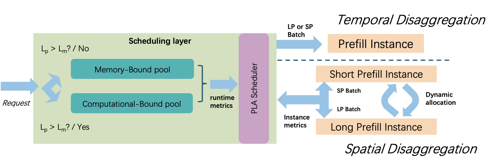

# LAPS: Length-Aware Prefill Scheduling for LLM Serving

**Accepted to MLSys 2026** | [arXiv](https://arxiv.org/abs/2601.11589)

**Authors:** Jianshu She, Zonghang Li, Hongchao Du, Shangyu Wu, Wenhao Zheng, Eric Xing, Zhengzhong Liu, Huaxiu Yao, Jason Xue, Qirong Ho

## MLSys Artifact Evaluation

For MLSys artifact evaluation on **8x H200/H100 with InfiniBand**, please go to [bench_laps_prefill_throughput/](bench_laps_prefill_throughput/).

**Evaluating on A100 GPUs?** Switch to the [`a100-eval`](https://github.com/Jianshu-She/LAPS/tree/a100-eval) branch for one-click setup:

```bash
git checkout a100-eval
bash install.sh && conda activate laps
bash bench_laps_prefill_throughput/run_a100_all.sh   # runs 0.5B, 3B, 7B on 2x A100
```

## Overview

In prefill-decode (PD) disaggregated LLM serving, prefill workers process prompts of widely varying lengths. When short and long prefills share a batch, GPU utilization suffers: short sequences finish early and waste compute while long sequences dominate latency, creating head-of-line blocking that degrades both throughput and time-to-first-token (TTFT).

LAPS introduces a three-level scheduling framework that addresses this interference. **Dual-Queue Scheduling** separates short and long prefills into distinct queues so each batch contains similarly-sized sequences. **Waiting Window** adds a configurable delay to accumulate enough same-length requests for high-utilization batches. **Dynamic Allocation** adjusts the prefill-decode GPU split at runtime based on queue pressure, preventing either pipeline stage from becoming a bottleneck.



## Features

| Feature | Description | Docs |
|---|---|---|
| Dual-Queue Scheduling | Separates prefill requests into short/long queues to eliminate length interference | [docs/laps_scheduler.md](docs/laps_scheduler.md) |
| Waiting Window | Accumulates same-length requests before dispatching to maximize batch utilization | [docs/laps_scheduler.md](docs/laps_scheduler.md) |
| Dynamic Allocation | Adjusts prefill/decode GPU ratio at runtime based on queue pressure | [docs/laps_scheduler.md](docs/laps_scheduler.md) |

## Quick Start

```bash
python -m sglang.launch_server \
    --model <model> \
    --enable-laps
```

## Documentation

- [docs/laps_scheduler.md](docs/laps_scheduler.md) — Detailed design and configuration options
- [docs/code_changes.md](docs/code_changes.md) — Code changes vs vanilla SGLang (with attention-in-graph deep dive)
- [bench_laps_prefill_throughput/README.md](bench_laps_prefill_throughput/README.md) — Test and benchmark scripts

## Acknowledgements

Built on [SGLang](https://github.com/sgl-project/sglang). Licensed under Apache 2.0.
