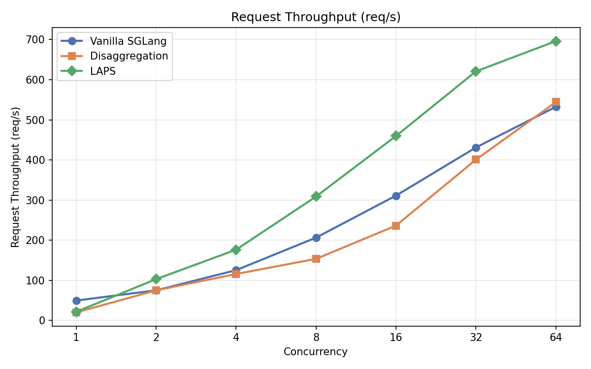
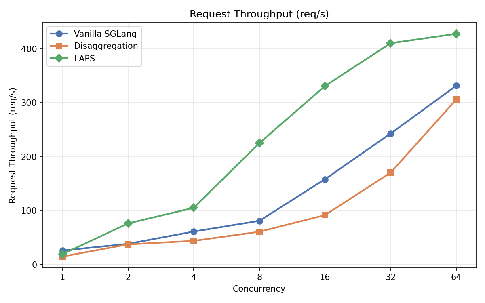
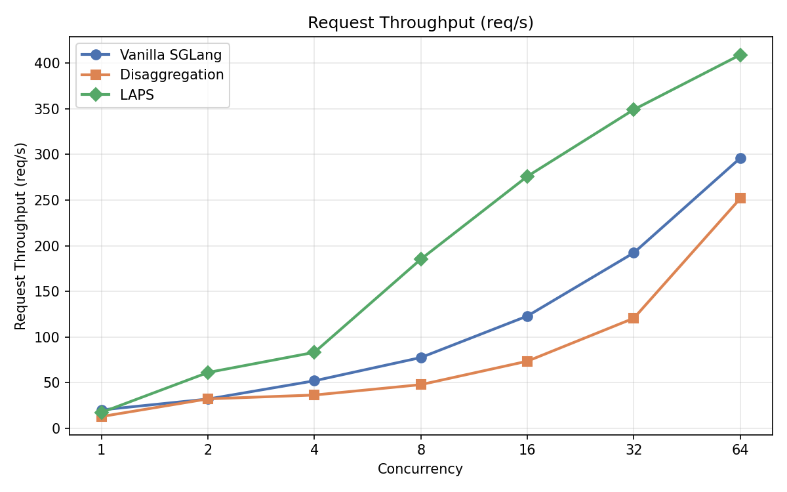
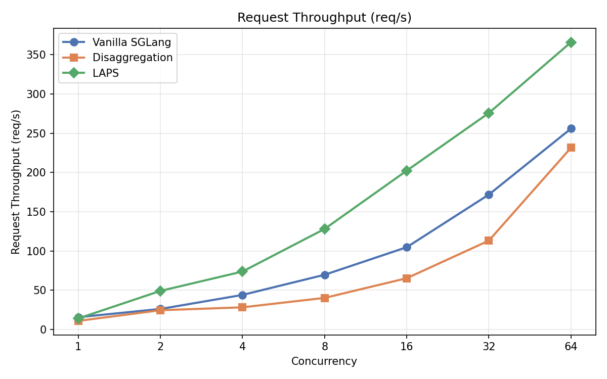

# LAPS Artifact Evaluation

This directory contains everything needed to reproduce the LAPS benchmark results.

## Running on Alternative Hardware

The default benchmarks (Section 3) target **8x H200 GPUs with InfiniBand (mooncake RDMA)**. If your hardware differs, use one of the configurations below.

### 4x H100 GPUs (no InfiniBand)

Uses the **nixl** backend (UCX/shared memory) instead of mooncake RDMA, avoiding TCP ephemeral port exhaustion.

```bash
bash install.sh
conda activate laps
bash bench_laps_prefill_throughput/run_all_h100_4gpu.sh
```

This runs Qwen2.5-7B and Qwen2.5-14B (both TP=2, using all 4 GPUs). You can also run individual models:

```bash
bash bench_laps_prefill_throughput/run_all_h100_4gpu.sh 7b    # 7B only
bash bench_laps_prefill_throughput/run_all_h100_4gpu.sh 14b   # 14B only
```

### 2x A100 GPUs (no InfiniBand)

Switch to the **[`a100-eval` branch](https://github.com/Jianshu-She/LAPS/tree/a100-eval)** which includes FlashInfer backend support for Batch Prefill CUDA Graph and the nixl transfer backend:

```bash
git checkout a100-eval
bash install.sh
conda activate laps
bash bench_laps_prefill_throughput/run_a100_all.sh
```

Benchmarks Qwen2.5-0.5B, 3B, 7B on 2 GPUs (TP=1). See the [`a100-eval` README](https://github.com/Jianshu-She/LAPS/tree/a100-eval/bench_laps_prefill_throughput) for details.

---

## 1. Installation

From the **repo root**, run the install script to set up the environment:

```bash
bash install.sh
conda activate laps
```

This creates a conda environment with SGLang (LAPS fork), mooncake-transfer-engine, and sglang-router.

**Prerequisites:**
- conda (miniconda or anaconda)
- NVIDIA GPUs with CUDA drivers (NVIDIA Driver >= 550)
- CUDA Toolkit >= 12.4 (recommended: 12.6)
- InfiniBand device (for mooncake RDMA transfer; see [Alternative Hardware](#running-on-alternative-hardware) for H100/A100 without IB)

**Software dependencies** (automatically installed by `install.sh`):
| Package | Version | Notes |
|---|---|---|
| Python | 3.12 | via conda |
| PyTorch | 2.9.1 | with CUDA support |
| sgl-kernel | 0.3.21 | SGLang CUDA kernels |
| flashinfer | 0.6.3 | FlashInfer attention backend |
| transformers | 4.57.1 | HuggingFace Transformers |
| mooncake-transfer-engine | latest | KV cache transfer (RDMA/TCP) |
| sglang-router | latest | Request routing |
| cuda-python | 12.9 | CUDA Python bindings |

## 2. Dataset

The benchmarks use LMSYS-Chat-1M prompts. The dataset file is at `data/lmsys_chat_10k.jsonl` (relative to repo root). The scripts locate it automatically.

## 3. Run Benchmarks

Each benchmark launches a PD disaggregation cluster (prefill server + decode server + router), runs 3 settings (Vanilla SGLang, Disaggregation, LAPS) across 7 concurrency levels, and generates a `summary.txt` with throughput/latency tables.

### Quick Evaluation (One Command)

Run all 4 model sizes sequentially:

```bash
bash run_all_benchmarks.sh
```

This runs: 7B (2 GPU) → 14B (8 GPU) → 32B (8 GPU) → 72B (8 GPU).

You can also select specific models:

```bash
bash run_all_benchmarks.sh 7b          # only 7B
bash run_all_benchmarks.sh 14b 32b     # only 14B and 32B
```

### Run Individual Models

| Script | Model | GPUs Required | TP Size |
|---|---|---|---|
| `scripts/bench_7b_2gpu.sh` | Qwen2.5-7B | 2 | 1 |
| `scripts/bench_14b_8gpu.sh` | Qwen2.5-14B | 8 | 4 |
| `scripts/bench_32b_8gpu.sh` | Qwen2.5-32B-Instruct | 8 | 4 |
| `scripts/bench_72b_8gpu.sh` | Qwen2.5-72B-Instruct | 8 | 4 |

Example:

```bash
bash scripts/bench_7b_2gpu.sh     # ~2 GPUs, fastest to run
bash scripts/bench_72b_8gpu.sh    # ~8 GPUs, largest model
```

## 4. Results

Each run creates a timestamped results directory:

```
results_7b_2gpu_20260312_143022/
├── summary.txt          # <-- Start here: throughput, latency, speedup tables
└── raw/                 # Per-setting, per-concurrency JSON/TXT + server logs
    ├── vanilla_sglang_cc1.json
    ├── vanilla_sglang_cc1.txt
    ├── laps_cc64.json
    ├── ...
    └── laps_prefill.log
```

The `summary.txt` contains:
- Request throughput (req/s) across all concurrency levels
- Prefill throughput (tok/s)
- Mean TTFT latency (ms)
- Speedup vs Vanilla SGLang

## 5. Expected Results

All experiments use 10,000 LMSYS-Chat prompts with `max_new_tokens=1` (prefill-only throughput), sweeping concurrency from 1 to 64. Hardware: NVIDIA H200 GPUs with InfiniBand (mooncake RDMA backend).

### Qwen2.5-7B (TP=1, 2 GPUs)

| Setting | cc=1 | cc=2 | cc=4 | cc=8 | cc=16 | cc=32 | cc=64 |
|---|---|---|---|---|---|---|---|
| vanilla_sglang | 49.3 | 74.8 | 125.1 | 206.2 | 311.0 | 431.1 | 532.5 |
| disaggregation | 19.7 | 74.7 | 115.5 | 153.3 | 236.2 | 400.8 | 544.2 |
| laps | 21.2 | 102.7 | 176.1 | 308.7 | 459.6 | 620.8 | 696.2 |



### Qwen2.5-14B (TP=4, 8 GPUs)

| Setting | cc=1 | cc=2 | cc=4 | cc=8 | cc=16 | cc=32 | cc=64 |
|---|---|---|---|---|---|---|---|
| vanilla_sglang | 25.9 | 38.4 | 61.2 | 81.0 | 158.2 | 242.9 | 331.5 |
| disaggregation | 14.8 | 37.4 | 43.9 | 60.8 | 91.6 | 170.3 | 305.9 |
| laps | 19.2 | 76.3 | 105.2 | 225.2 | 331.0 | 410.4 | 427.9 |



### Qwen2.5-32B-Instruct (TP=4, 8 GPUs)

| Setting | cc=1 | cc=2 | cc=4 | cc=8 | cc=16 | cc=32 | cc=64 |
|---|---|---|---|---|---|---|---|
| vanilla_sglang | 20.0 | 31.9 | 51.9 | 77.4 | 122.9 | 192.2 | 296.1 |
| disaggregation | 12.7 | 32.1 | 36.3 | 47.7 | 73.4 | 120.5 | 251.8 |
| laps | 17.2 | 61.0 | 83.1 | 185.2 | 276.0 | 349.2 | 409.2 |



### Qwen2.5-72B-Instruct (TP=4, 8 GPUs)

| Setting | cc=1 | cc=2 | cc=4 | cc=8 | cc=16 | cc=32 | cc=64 |
|---|---|---|---|---|---|---|---|
| vanilla_sglang | 15.5 | 26.0 | 43.9 | 69.6 | 104.7 | 171.8 | 255.9 |
| disaggregation | 10.8 | 24.4 | 28.1 | 40.1 | 65.2 | 113.1 | 231.5 |
| laps | 13.9 | 49.0 | 73.7 | 128.0 | 202.3 | 275.8 | 366.0 |



## 6. Notes

- Absolute throughput numbers will differ across GPU types. The **relative speedup** of LAPS over vanilla SGLang should be consistent.
- Lower memory GPUs may require reducing `--mem-fraction-static` (default: 0.85).
- All benchmark scripts support environment variable overrides (e.g. `PYTHON=`, `IB_DEVICE=`, `BACKEND=`, `NUM_PROMPTS=`).
